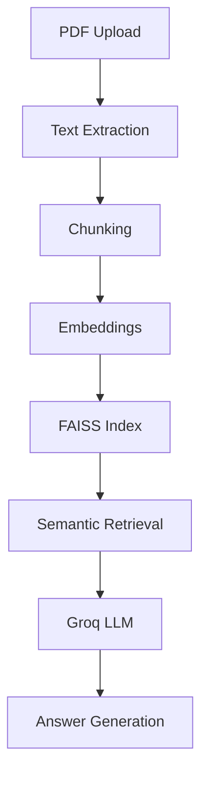

# Vellum

**Multi-Document Intelligence Platform**

Upload PDFs, ask questions using Retrieval-Augmented Generation (RAG), compare documents, and extract structured insights from unstructured text.

---

## Demo

### Screenshots

Replace with your screenshots later.

```text
docs/screenshots/

01_dashboard.png
02_upload.png
03_chat.png
04_compare.png
05_extract.png
```

### Demo GIF

Add later:

```text
docs/demo/vellum-demo.gif
```

---

## Features

### Document Management

* Upload PDF documents
* Store metadata in PostgreSQL
* Persistent document indexing

### AI-Powered Question Answering

* Retrieval-Augmented Generation (RAG)
* Semantic search using FAISS
* Context-aware answers using Groq LLM

### Document Comparison

* Compare two uploaded PDFs
* Identify key differences
* Detect missing information
* Generate concise summaries

### Structured Information Extraction

* Extract dates
* Extract numerical values
* Extract entities
* Extract key facts

### Search Infrastructure

* SentenceTransformer embeddings
* FAISS vector database
* Persistent vector indexes

---

## Architecture



---

## Tech Stack

### Backend

* Python 3.13
* FastAPI
* SQLAlchemy
* PostgreSQL
* Pydantic

### AI Layer

* LangChain Text Splitters
* SentenceTransformers
* FAISS
* Groq API

### Frontend

* React
* Vite
* Axios

### DevOps

* Docker
* Docker Compose
* GitHub Actions

---

## Project Structure

```text
vellum/

├── backend/
├── frontend/
├── docs/
├── .github/workflows/
├── docker-compose.yml
└── README.md
```

---

## Running Locally

### Backend

```bash
cd backend

python -m venv venv

venv\Scripts\activate

pip install -r requirements.txt

uvicorn app.main:app --reload
```

### Frontend

```bash
cd frontend

npm install

npm run dev
```

---

## Running With Docker

```bash
docker compose build

docker compose up
```

Frontend:

```text
http://localhost:5173
```

Backend:

```text
http://localhost:8000/docs
```

---

## Core Capabilities

### RAG Pipeline

PDF → Chunking → Embeddings → FAISS → Retrieval → Groq → Answer

### Document Comparison

PDF A → Groq Analysis → Differences → Missing Information → Summary

### Information Extraction

PDF → Groq Analysis → Dates / Numbers / Entities / Facts

---

## Performance

Typical MVP performance:

* PDF Upload: < 2 seconds
* Text Extraction: < 5 seconds (100-page PDF)
* Semantic Retrieval: < 200 ms
* RAG Response: 1–3 seconds
* Supports thousands of indexed chunks per document

---

## Future Enhancements

### Phase 2

* Authentication
* Multi-user support
* Chat history persistence
* Pinecone integration
* Cloud object storage
* Multi-agent workflows
* Advanced analytics dashboard
